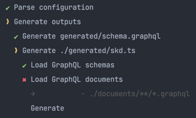
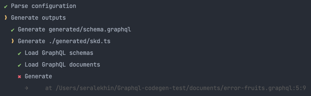

# Graphql-codegen-test
Graphql codegen test

## Usage

Generate schema and sdk
```shell
npm run generate
```

## Codegen errors

### Your can't use graphql-codegen without documents

At the beginning of development, I want to generate a schema.graphql file without sdk.ts, 
but I can’t do it, because code generation will fail with an error



I have two outputs, one schema.graphql, the other sdk.ts.
Both run in the same config, the schema completes with a green checkmark, 
the sdk fails (I don't have document files).
But the schema is not written to file

### Your can't use graphql-codegen with documents error

Imagine a situation that we have an error-fruits.graphql document.
In next api version backend remove error_field form fruits query.

I can't generate schema.graphql (move error-fruits.graphql to documents folder),
because code generation will fail with an error



In this case, everything is similar to the previous case.

**Is there any way to generate schema.graphql file even with sdk.ts generation error?**

